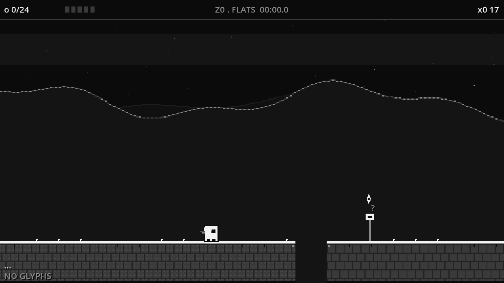
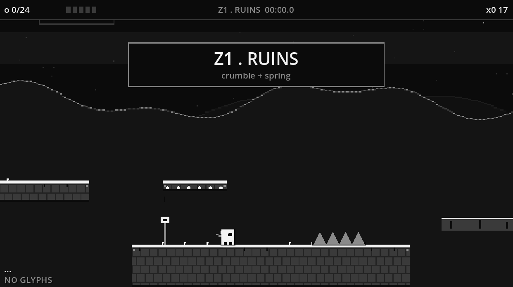
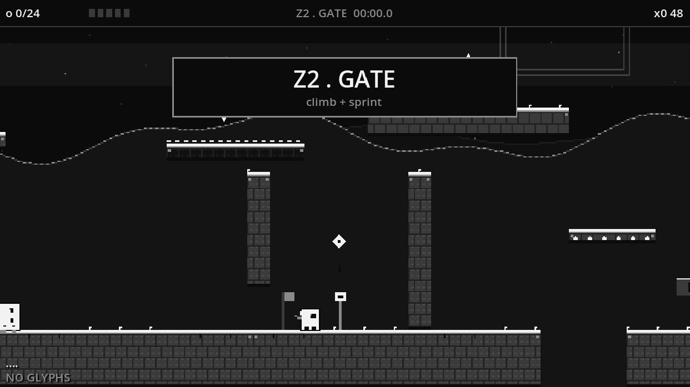

# WHITE SIGNAL

A monochrome deckbuilder × platformer. You are a **SPARK** crossing a dead
relay world — collect **SHARDS**, draft **GLYPHS** at every **SIGNAL SURGE**,
and light the **GATE**.

> 1-bit ditherpunk · 480×270 · deckbuilder × platformer hybrid





## Versions in this repo

| Path | What | Status |
|---|---|---|
| `/` (root) | **Godot 4.6 port** — the active project | playable |
| `/js-original` | Vanilla JS canvas engine — the feel reference & spec | playable |

Both implement the same design (see [`js-original/GDD.md`](js-original/GDD.md)):
fixed-clamped loop, coyote/buffer, wall kicks with span-gated grace, dash,
2×JUMP, and a 10-glyph draft deck (incl. cursed row: HEAVY, GLASS).

## Run (Godot)

Open the project with **Godot 4.6+** and press F5, or:

```bash
godot --path . 
```

Headless validation (integration suite, outcome-based assertions):

```bash
WS_TEST=1 godot --headless --path .
```

## Run (JS original)

```bash
cd js-original
python3 -m http.server 8000   # → http://localhost:8000
```

## Controls

| Input | Action |
|---|---|
| A/D or ←/→ | Move |
| Space / W / ↑ | Jump (hold = higher) |
| Shift | Dash (glyph) |
| 1/2/3 · S | Draft pick · skip |
| R / P · F11 | Respawn / pause · fullscreen |

## Design docs

- [`js-original/GDD.md`](js-original/GDD.md) — living design doc (v4): pillars,
  tuning table (source of truth), glyph deck, zones, art direction.
- Best-run persistence: Godot saves to `user://ws_best.json`, JS to localStorage.