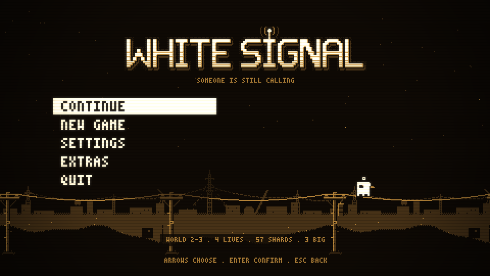
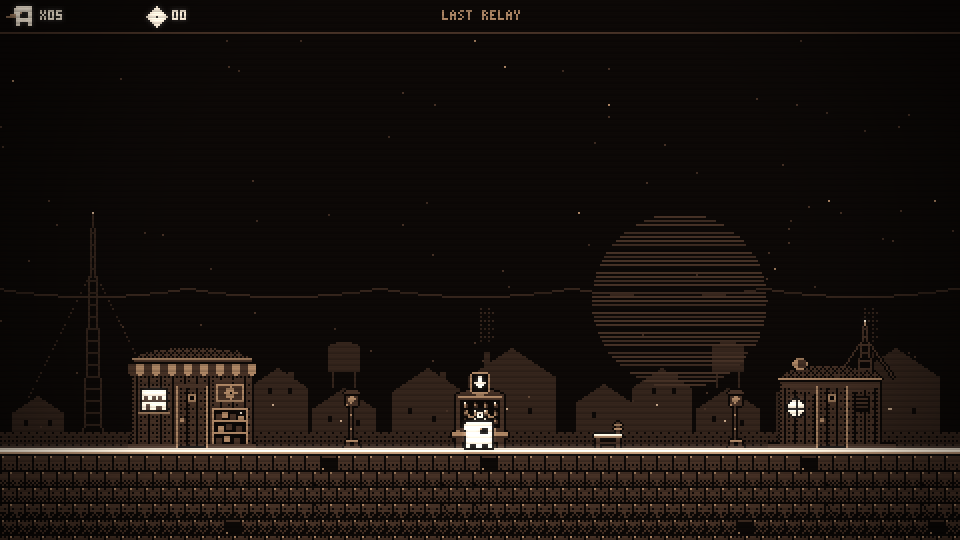
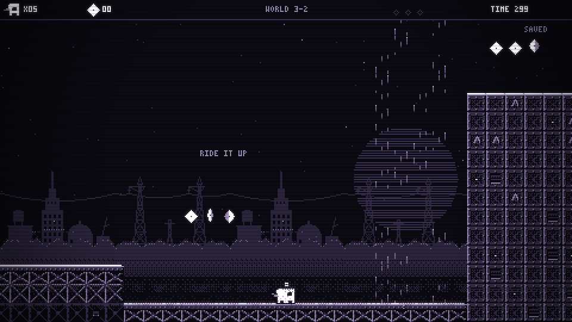
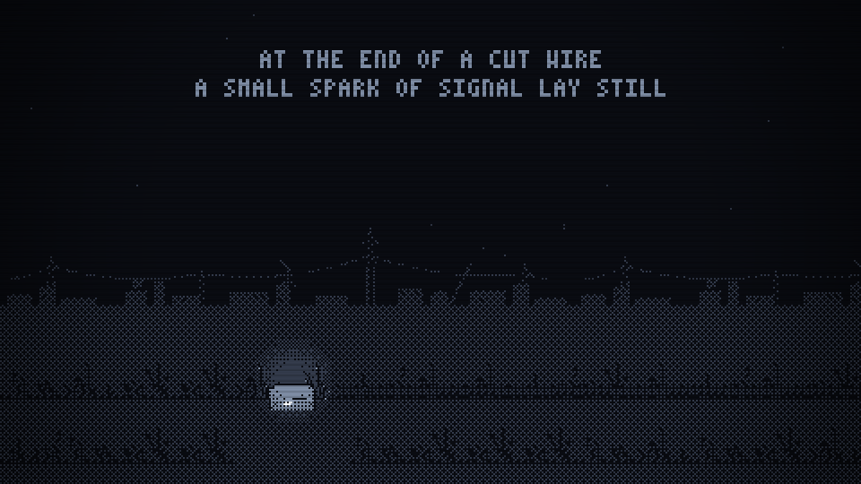

# WHITE SIGNAL

A small spark of signal wakes when a dead line starts ringing, and follows it, gate by gate, to find out who is still calling.

A classic Mario-style pixel platformer for ages 10 and up. Short levels, lives, a timer, shards to collect, little Pips to rescue from the glass and a mast at the end of every level. Between worlds you return to **Last Relay**, a village whose people carry the story, where Dot looks after every Pip you bring home.






## What's in the game

| Part | Status |
|---|---|
| Title screen and story intro | Built |
| Last Relay (hub village, shop, radio shack) | Built |
| World 1: The Flats (4 levels, bonus room, training yard) | Built and proven |
| World 2: The Switchyard (4 levels, relay boss) | Built and proven |
| World 3: The Aerials (4 levels, the Spire) | Built and proven |
| World 4: Dead Air and the ending | Planned |

The full design is in [docs/GDD.md](docs/GDD.md).

## Run it

Open the project with **Godot 4.7** or later and press F5, or:

```bash
godot --path .
```

## Controls

| Keyboard | Pad | Action |
|---|---|---|
| Arrows or A/D | Stick or D-pad | Move |
| Space, W or Up | A | Jump (hold for height) |
| Shift | RB | Dash |
| X | X | The Arc (after World 1) |
| Down | Down | Talk, doors, pipes. Down + jump drops through girders |
| Esc | Start | Pause |

Keys can be remapped in Settings. In a development build, 0 to 9 on the pause screen jump to any level for testing.

## Levels are proven

Every level is a text file (`levels/world*/*.txt`). A checker plays each one with the game's own physics and proves it can be finished and that every shard can be reached:

```bash
python tools/levels/build_maps.py          # every level
python tools/levels/build_maps.py 2-3      # one level
```

It writes a map (`.png`), results (`.proof.json`) and the winning route (`.route.json`) next to each level. The game then replays every route to make sure the checker and the game agree.

## Tests

```bash
godot --headless --path . --script res://scripts/world1/w1_replay_test.gd
godot --headless --path . --script res://scripts/world1/w1_village_test.gd
godot --headless --path . --script res://scripts/world1/w1_arc_test.gd
godot --headless --path . --script res://scripts/title/title_test.gd
godot --headless --path . --script res://scripts/intro/intro_test.gd
godot --headless --path . --script res://scripts/world1/w1_pips_test.gd
```

Tests use their own save files under `test-user/`, never the player's save.

## Where things are

| What | Where |
|---|---|
| Design | `docs/GDD.md`, `docs/levels/`, `docs/story/` |
| Levels and dialogue | `levels/`, `levels/story/npcs.json` |
| Game rules | `scripts/world1/w1_sim.gd`, mirrored by `tools/levels/sim.py` |
| Game, title and intro | `scripts/world1/w1_game.gd`, `scripts/title/`, `scripts/intro/` |
| Art (generated in code) | `assets/world1/src/make_sheets.py` |
| Music and sound (generated in code) | `tools/audio/sfx8.py`, `assets/audio/sfx8/` |

## Older versions

Earlier versions of the game are no longer in the project: the Classic card-draft run, the exploration campaign, the Afterlight study and the first JavaScript version. Git keeps them under the tag `legacy-archive`. To look at them, run `git checkout legacy-archive`, and `git checkout main` to come back.
