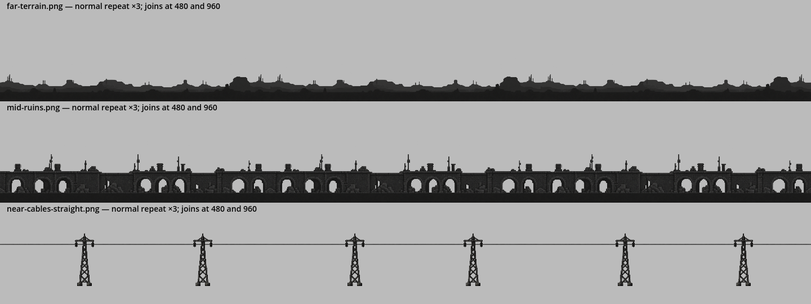
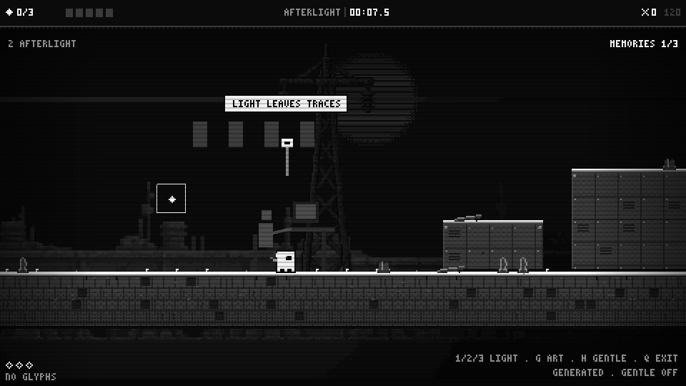
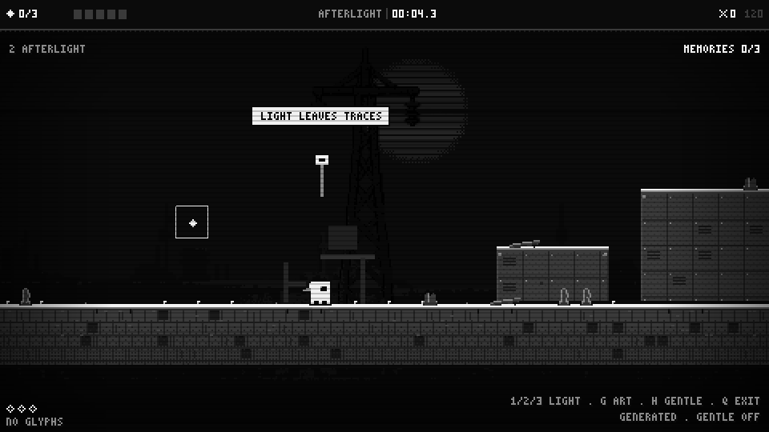
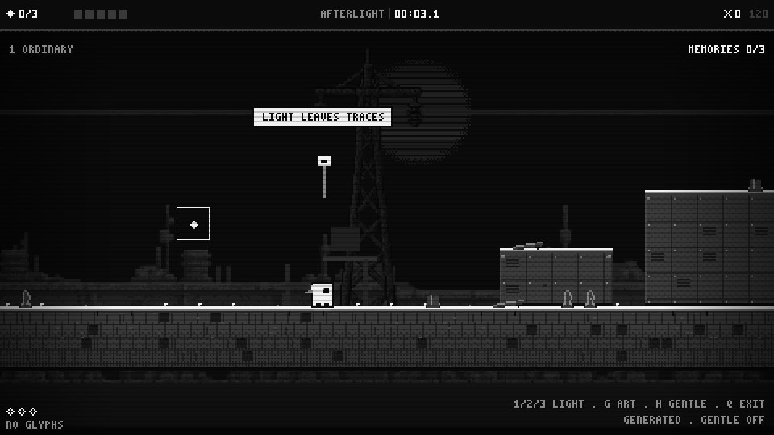

# Afterlight prototype results

13 September 2026. This records implemented behavior and local checks, separately
from the proposals in [lighting research](lighting-darkness.md) and
[horizontal tile research](parallax-tiles.md).

## What is playable

L on the title enters THE ROOM REMEMBERS. Three blocks replay six-second memories
of former Operators at abandoned desks. The three unique memories unlock the exit;
repeated hits replay light without paying more shards. Beacons leave windows lit
until the study restarts. Pause freezes the memory clock; death retains discovered
memories. Q returns to the title, and the saved campaign boundary is preserved.

1/2/3 compare ordinary illumination, authored darkness and readability assist.
G compares generated art with the original procedural backdrop. H lengthens the
memory attack from 0.35 to 0.8 seconds and stops the service lamp's sway. It does
not currently disable camera parallax. No new enemy, collision gate or lethal
darkness mechanic is introduced. The layout deliberately remains a mechanic test;
the backlog now requires deeper exploration research before later campaign authoring.

## Art and rendering

The built-in image generator supplied separate terrain, ruins and cable planes.
The original non-looping v1 concepts are retained separately. V2 PNGs have real
alpha and remain unmodified at 2172×724. Runtime nearest sampling at each logical
size and a stepped neutral shader keep background values below the solid scene.
This is **not strict four-gray output**: source art has intermediate alpha and the
shader quantizes to 1/32 increments. Exact palette finishing remains a production task.

| Plane | Active PNG in assets/backgrounds/afterlight-v2 | Logical period | Scroll factor |
|---|---|---|---|
| Far | far-terrain.png | 960×320 | 0.12 |
| Middle | mid-ruins.png | 768×256 | 0.28 |
| Near background | near-cables-straight.png | 960×320 | 0.48 |

The existing CanvasLayer architecture uses explicit normal-repeat sprites rather
than adding a second camera-following system. Every layer has a positive-origin
sprite plus an adjacent copy at precisely the scaled width. Translation is rounded
before wrapping. The 480px logical viewport fits within every period. A single
existing procedural broadcast disc is drawn separately; it does not repeat.

Lighting changes only background materials and memory details. The player,
platforms and hazards keep their existing renderer. This is a bounded radial-field
shader, **not shadow casting or occlusion**. Native PointLight2D/occluder comparison
from the research brief has not been implemented.

## Seam evidence and limits

Three-copy engine-rendered boards were inspected over dark, light and checker
backgrounds. Each plane was also isolated in the actual room renderer. Automated
camera sweeps exercised two periods in each direction, reversals, slow one-logical-
pixel steps and stops. Pixel comparisons confirm identical frames after full
periods and no position-reset jump at the wrap. These prove repetition behavior;
they do not certify artistic quality at every display size.

Source-image mean premultiplied-red/alpha jumps at the boundary versus the internal
95th percentile are recorded in `evidence/tile-seams.json`. Images are approximately
neutral, but this single-channel diagnostic is not a complete color-difference test.

- Terrain: RGB wrap 0.002265 versus internal p95 0.001253; alpha wrap 0.000645
  versus 0.004165. The value flag was inspected: the contour connects in the boards,
  with a small brightness mismatch. Acceptable for this dark prototype, still a
  source-art finishing item; do not market this PNG as mathematically seamless.
- Ruins: RGB wrap 0.003995 versus 0.006268; alpha 0.000466 versus 0.015047.
- Straight cable: RGB wrap 0.000129 versus 0.010052; alpha 0.000330 versus 0.021839.
- The first sagging cable candidate failed continuity (alpha wrap 0.030159 versus
  0.011082); it remains as a rejected source candidate and is not loaded by the game.
  An image-edit attempt produced an unsuitable background preview and was discarded.
  A fresh straight-cable generation supplied the active tile.

No mirroring, edge crossfade or destructive pixel repair hides the joins. Production
approval still requires palette/alpha finishing, wider display coverage testing and
recorded human review of long scrolls. The test script is reproducible; the retained
evidence contains stills and logs rather than a video recording.

## Verification

Godot 4.7.2 Compatibility renderer on Windows; 480×270 logical canvas, 960×540
window (2× integer scaling). The local run passed:

- 16 state/save/memory assertions; 10 real-input dark/assist route assertions.
- 7 rendered-alpha, luminance and unchanged-solid-pixel assertions.
- 9 camera-repeat, one-pixel wrap and stop-stability assertions across three planes.
- 24 existing campaign assertions, 2 campaign route checks, 8 original port checks.

Both study routes collected all memories through real jump collisions and reached
the exit with zero deaths and no glyphs. This is automated traversal, not evidence
that first-time players understand the room. A fixed foreground step patch was
pixel-identical in ordinary, dark and memory captures; measured ruins pixels dimmed
and brightened as intended. No shader compile or script failures remained.

The sandbox emitted certificate-store and shader-cache-write warnings; these are
environment limitations. Existing teardown ObjectDB leak warnings appeared in
headless campaign tests and also in the study state test. Track those separately;
they are not evidence of successful long-session memory behavior.

RTX 4070, 120 frame-interval samples per mode after warmup at one fixed camera:
ordinary/dark/assist median 8.399/8.448/8.400 ms, p95 8.762/8.735/8.698 ms; original
procedural control median 8.414 ms, p95 8.677 ms. Generated scene: 29 draw calls;
procedural control: 31. These frame intervals are limited near 120 fps and are a
smoke check, **not isolated GPU cost or a minimum-hardware performance guarantee**.

## Evidence board

The joins are at x=480 and x=960; the far value mismatch is most exposed over light
gray. Cable continuity and complete arches are visible without another plane hiding them.

The old occupant and monitor appear behind the player; the empty chair persists.
The bright step edges remain legible while the backdrop changes.

## Next decisions

Run first-time player readability and lore tests before adopting darkness across
the campaign. Compare shadow methods separately. Finish the source tiles to a
chosen final palette. Pursue the queued Hollow Knight-led level-design study with
room graphs and a graybox before converting these straight test strips into levels.
